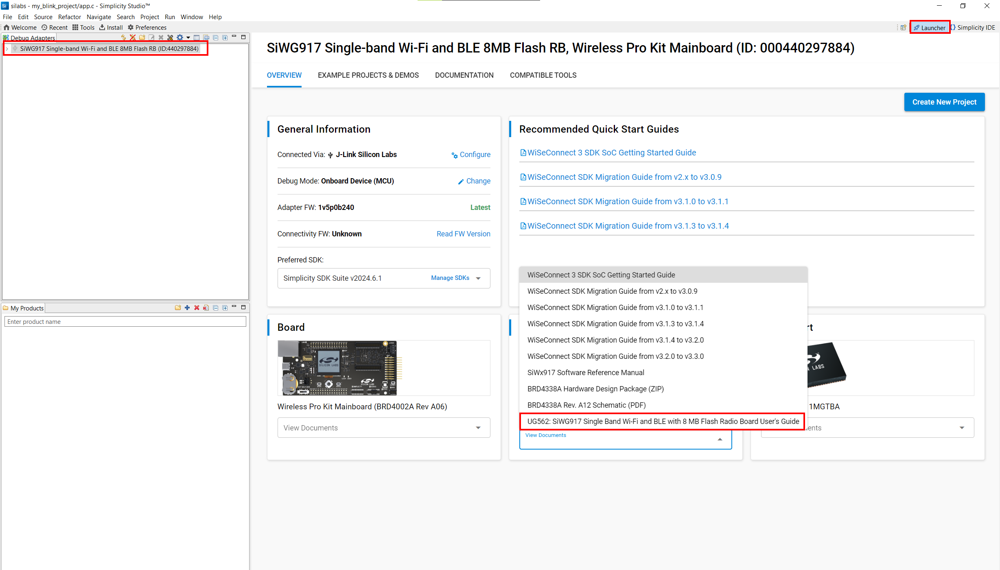
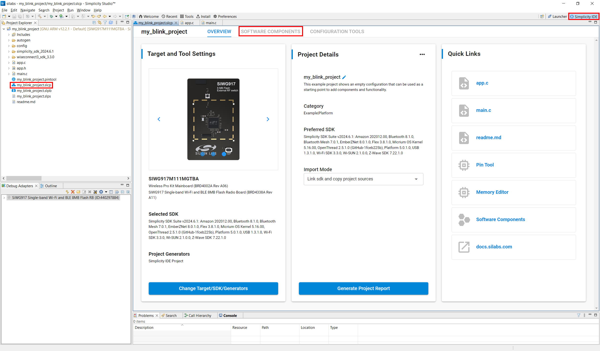
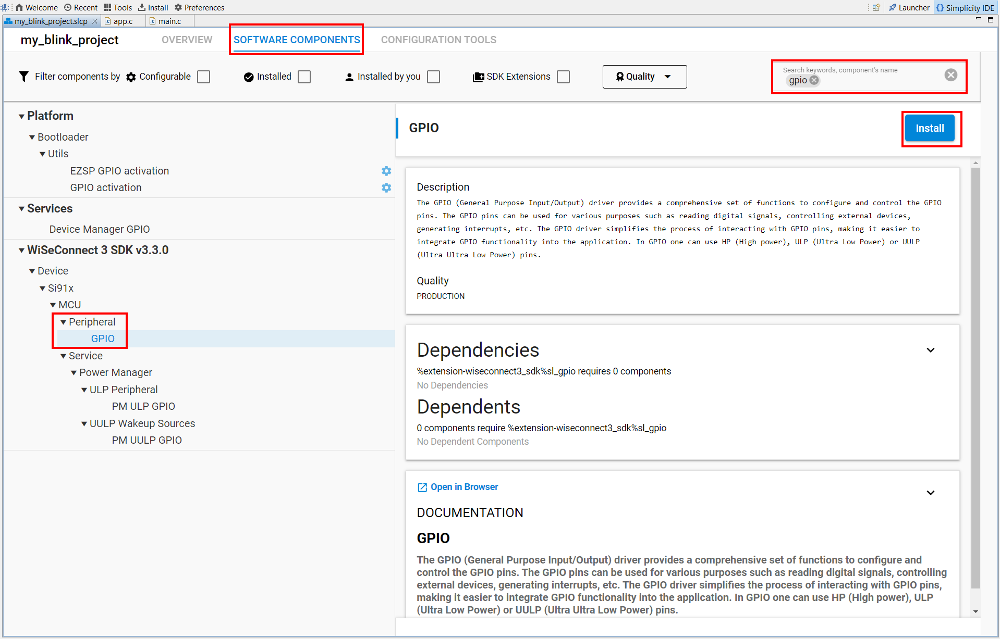
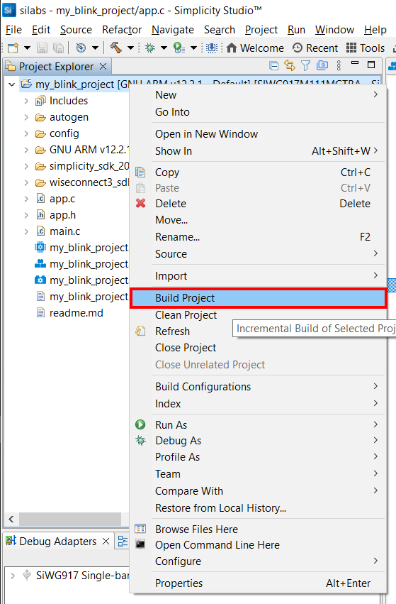
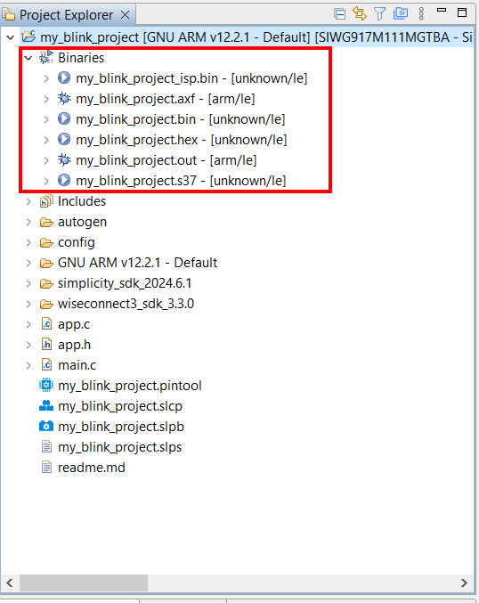
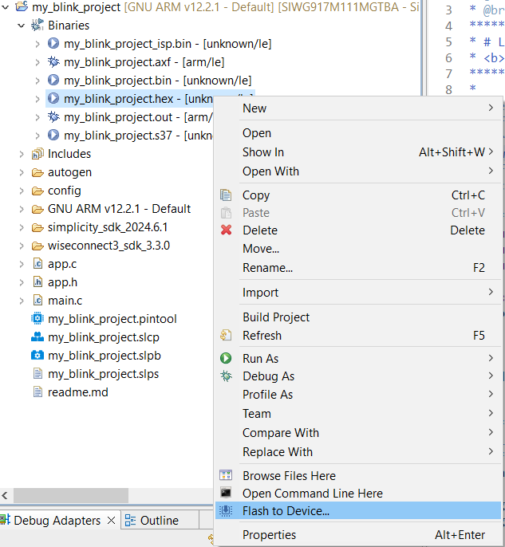
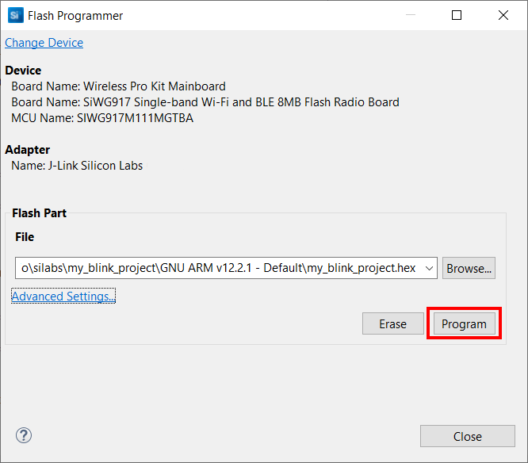

# First Wx917 Project

## Goals

In this article, we are going to use Simplicity Studio 5 and WiseConnect 3
to help us build our first project. The project will be developed on top of the 
"Empty C" example project available in the IDE. Our goal is to blink the on-board LED on and off. To get your environment ready, 
make sure you have the [SDK and WiseConnect 3 installed](#).

## Requirements

- Simplicity Studio 5.
- Simplicity SDK.
- WiseConnect 3. 
- BRD4338A.
- BRD4002A (WSTK).

## Starting Our Project

With Simplicity Studio 5 open, plug your BRD4338A radio board on your computer. 
Simplicity Studio will automatically recognize your board. 


Make sure you have the **Launcher** perspective open (indicated by the number [1] in the image above). Select your device [2], verify that you have the latest **Adapter FW** and **Connectivity FW** [3] and finally, start a new project by clicking on the **Create New Project** button [4].

On the project wizard, select your SDK, in my case, it's Simplicity SDK 2024.6.1 and Toolchain **Simplicity IDE / GNU ARM v12.2.1**. Note that version GNU ARM v12.2.1 or newer is required to work with Simplicity SDK. 


On the next step, we can select our base project, in this case we are looking for the **SL Si91x - Empty C Project SoC** project.


Click **Next**.

Finally, we can name our project "my_blink_project". 


In this step of the Project Wizard, you can also choose to link SDK files or have Simplicity Studio copying all of the SDK files to your project folder. To save on disk space, we can just let the default option selected "Link SDK and copy project sources", this will only copy the example project files. Click **Finish**.

You should be presented with a new project as shown below in the "Simplicity IDE" perspective, indicated by the option on the top right corner. 


> If your IDE looks different and you want to set it to its default settings, click on the menu **[Window] > [Perspective] > [Advanced] > [Reset Perspective...]**. 

On the left side, the **Project Explorer** presents all the files of your project.
The Table below describes the typical folders contained in a project.

| Folder | Description | 
| ----------- | ----------- |
| **Includes/** | Aggregates all the header files (*.h) included in the project. | 
| **autogen/** | Files in this folder are generated and managed by Simplicity Studio. They allow Simplicity Studio to manage software components and the linker map. |
| **config/** | This folder contains all the configuration header files for the software components used in the project. |
| **simplicity_sdk/** | This folder contains the source and header files of the Simplicity SDK. |
| **wiseconnect3_sdk/** | Contains all the source and header files of the Wiseconnect 3 extension, necessary for development on the Wx917. |

The Table below describes the initial files of a Simplicity Studio project. 

| File | Description |
| ---- | ----------- |
| **app.c** | Source file where we can include the logic for our application. The functions included in this files are called by our `main` function from `main.c`. |
| **app.h** | Header file for `app.c`. | 
| **main.c** | This is where our `main` function is located. Some initialization code is included in order to run the software components and also the application. |
| **my_blink_project.slcp** | Project description file. It contains references to the SDK, extensions and components. See more in [https://siliconlabs.github.io/slc-specification/](https://siliconlabs.github.io/slc-specification/). |
| **my_blink_project.slpb** | Post-build script. This file contains rules that will execute after a successful build. This file implements an important step  when developing for the Wx917 in order to transform our binaries to the format you can flash on the chip. |
| **my_blink_project.slps** | File used by Simplicity Studio to store user settings and configuration information. |
| **readme.md** | Description of the project. |

## Modifying the Project

As we highlighted previously, Simplicity Studio projects have `app.c` as a starting point for the application. In the file we can see two functions. 

```c
/***************************************************************************/ /**
 * Initialize application.
 ******************************************************************************/
void app_init(void)
{
}

/***************************************************************************/ /**
 * App ticking function.
 ******************************************************************************/
void app_process_action(void)
{
}
```

In a bare-metal application `app_init` runs at the beginning once and, subsequently, `app_process_action` runs in an infinite loop. 

> Note that if a Real-Time Operating System (RTOS) is present, this flow might be different. 

Now, we have few things to do: 

1. Find which pin is attached to the LED. 
2. Include the General Purpose Input-Output (GPIO) driver to control the pin attached to the on-board LED.
3. Initialize the LED pin as an output. 
4. Toggle the state of the LED pin on/off.
5. Add a delay and go back to step 4.

### Finding the LED pin

Silicon Labs provides documentation for all board or devkit available, this usually comes in the format of a user guide, but we can also find lots of detailed information in the schematics. 

To find the appropriate User Guide (UG), we can either search for it online in the [Technical Resource Library](https://www.silabs.com/support/resources) or access it in Simplicity Studio. To find it on Simplicity Studio, select the `Launcher` perspective in the top right corner or in the menu **[Window] > [Perspective] > [Launcher]**  in the IDE, and search for the radio board documentation in the drop-down menu (see image below).



In the User Guide, we can find that the LEDs are connected to pins `ULP_GPIO_2` and `GPIO_10` in an active-high configuration.

### Installing the GPIO driver. 

Back to the `Simplicity IDE` perspective, we can add the GPIO driver by double-clicking the `my_blink_project.slcp` file. 



Now, in the `Software Components` tab, we can search for `GPIO` and install the **WiseConnect > Peripheral > GPIO** component.

> Tip: right click the drop-down menu and select "expand all" to expand all the search results at once. 



### Initializing the LED pin.

To initialize the LED pin we need to configure `pin 10`, this pin is connected to LED1, as indicated in the user guide. To do this, in `app.c` we first include the GPIO driver headers, define `led_pin` as a `GPIO_OUTPUT` and initialize the driver. 
```c
#include "sl_gpio_board.h"
#include "sl_driver_gpio.h"
#include "sl_si91x_driver_gpio.h"

static sl_si91x_gpio_pin_config_t led_pin = {
    .port_pin = (sl_gpio_t){
        .port = SL_SI91X_GPIO_10_PORT,
        .pin = 10
    },
    .direction = GPIO_OUTPUT
};

void app_init(void)
{
  sl_gpio_driver_init();
  sl_gpio_set_configuration(led_pin);
}
```

### Toggling the LED

Finally, to toggle the LED, we pass the address of `.port_pin` to `sl_gpio_driver_toggle_pin` and add a delay. 

```c
void app_process_action(void)
{
  sl_gpio_driver_toggle_pin(&led_pin.port_pin);
  for(volatile unsigned int i = 0; i < 10e5; ++i);
}
```

The delay given by the `for` loop is a software delay that will keep the CPU busy for 1 million cycles, giving our eyes the time to notice the change of the state of the LED. This delay is not the most efficient, but it serves our purpose. 

Our `app.c` file should look something like this: 

```c
#include "sl_gpio_board.h"
#include "sl_driver_gpio.h"
#include "sl_si91x_driver_gpio.h"

static sl_si91x_gpio_pin_config_t led_pin = {
    .port_pin = (sl_gpio_t){
        .port = SL_SI91X_GPIO_10_PORT,
        .pin = 10
    },
    .direction = GPIO_OUTPUT
};

void app_init(void)
{
  sl_gpio_driver_init();
  sl_gpio_set_configuration(led_pin);
}

void app_process_action(void)
{
  sl_gpio_driver_toggle_pin(&led_pin.port_pin);
  for(volatile unsigned int i = 0; i < 10e5; ++i);
}
```

## Compiling the Project

To build our project, right click the project in the Project Explorer and select **Build Project**. 

> Tip: You can also use the hammer icon in the menu bar as a shortcut. 



After compiling the files, Simplicity Studio will update our project with a **Binaries** folder in our file tree (see image below). 
In this folder we can notice different types of artifacts generated from our source-code. 



### The RPS format

Now, let's step back and explain the artifacts generated after building our project. 

If you looked closely to the console logs, by the end of the compilation, Simplicity Studio has executed a few extra steps. 

```
commander.exe postbuild ...\my_blink_project/my_blink_project.slpb" --parameter build_dir:"...\my_blink_project\GNU ARM v12.2.1 - Default"

Parsing file ...\my_blink_project/my_blink_project.slpb...

Running task RPS create...
Running task convert...
Running task convert...
Running task convert...
DONE
```

These steps are defined in the `.slpb` file and they are executed after the compiler has successfully built the project. The need for these steps is to convert the artifacts generated by the compiler to the adequate format expected by Wx917 (RPS format). Only files in this format can be flashed on the Wx917.

## Flashing the Firmware.

To flash our firmware, right click the `my_blink_project.hex` file and click on **Flash to Device...**



In the new window, click on **Program**



After flashing, your board will blink the LED1. 

