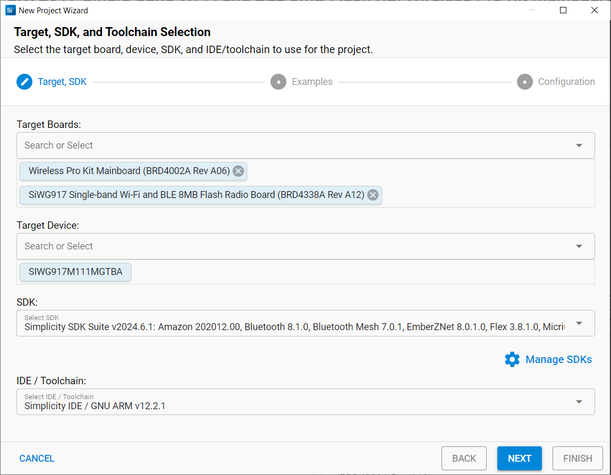

# First Wx917 Project

## Goals

On this article we are going to use Simplicity Studio 5 and WiseConnect 3
to help us build our first project. The project will develop on top of the 
"Empty C" example project available on the IDE. To get your environment ready, 
make sure you have the [SDK and WiseConnect 3 installed](#).

## Requirements

- Simplicity Studio 5
- Simplicity SDK.
- WiseConnect 3. 
- BRD4338A.
- BRD4002A (WSTK).

## Starting Our Project

With Simplicity Studio 5 open, plug your BRD4338A radio board on your computer. 
Simplicity Studio will automatically recognize your board. 

Make sure you have the **Launcher** perspective open (indicated by the number [1] in the image above). Select your device [2], verify that you have the latest **Adapter FW** and **Connectivity FW** [3] and finally, start a new project by clicking on the **Create New Project** button [4].

On the project wizard, select your SDK, in my case, it's Simplicity SDK 2026.6.1 and Toolchain **Simplicity IDE / GNU ARM v12.2.1**. Note that versions GNU ARM v12.2.1 is required to work with Simplicity SDK. 

On the next step, we can select our base project, in this case we are looking for the **SL Si91x - Empty C Project SoC** project.

Click **Next**.

Finally, we can name our project "my_blink_project". 

In this step of the Project Wizard, you can also choose to link SDK files or have Simplicity Studio copying all of the SDK files to your project folder. To save on space, we can just let the default option select to "Link SDK and copy project sources", this will only copy the project files. Click **Finish**.

You should be presented with a new project as shown below. 

> If your IDE looks different and you want to it to its default settings, click on **[Window] > [Perspective] > [Advanced] > [Reset Perspective...]"**. 

On the left side, the **Project Explorer** presents all the files of your project, which should have the following structure: 

- **Includes/:** Aggregates all the header files (*.h) included in the project. 
- **autogen/:** Files in this folder are generated and managed by Simplicity Studio. They allow Simplicity Studio to operate software components and the linker map. 
- **config/:** This folder contains all the configuration header files for the software components used in the project. 
- **simplicity_sdk/:** This folder contains the source and header files of the Simplicity SDK.  
- **wiseconnect3_sdk/:** This folder contains all the source and header files of the Wiseconnect 3 extension, necessary for development on the Wx917.
- **app.c:** Source file where we can include the logic for our application. The functions included in this files are called by our `main()` function from `main.c`.
- **app.h:** Header file for app.c. 
- **main.c:** This is where our `main()` function is located. Some initialization code is included in order to run our software components and also the application. 
- **my_blink_project.slcp:**  
- **my_blink_project.slpb:** 
- **my_blink_project.slps:**
- **readme.md:** 