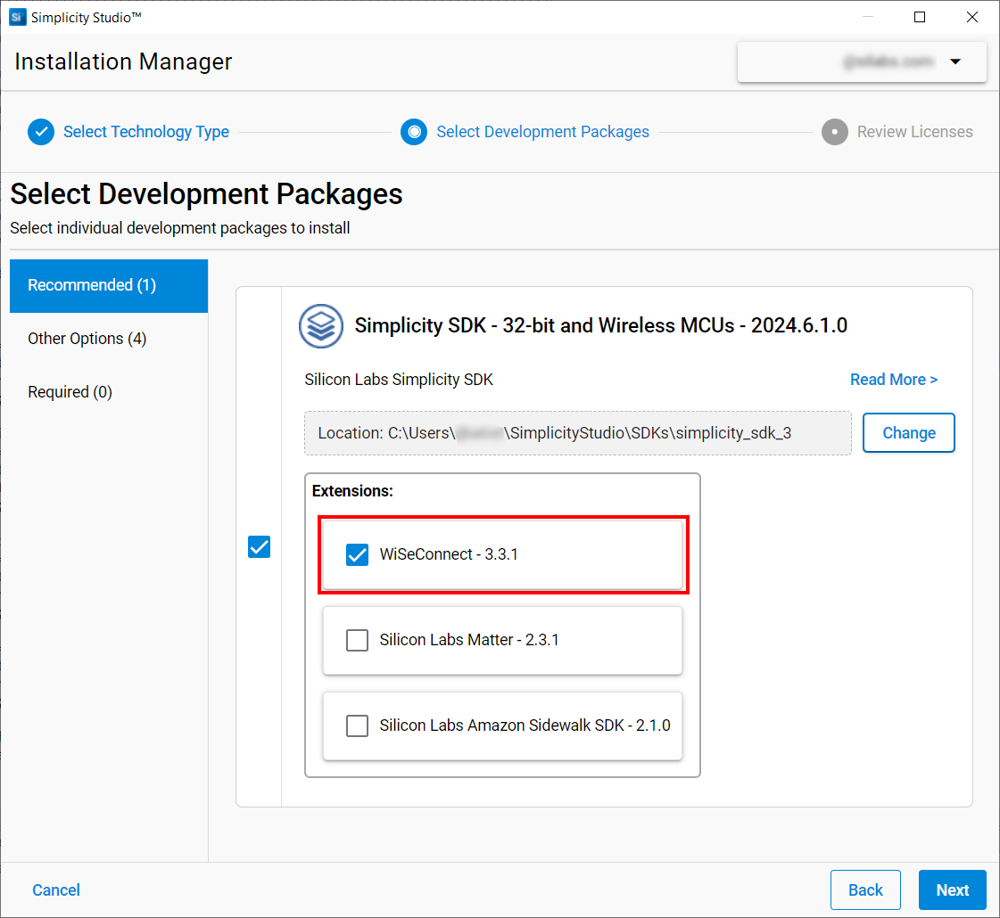

# Wiseconnect 3 

The Silicon Labs WiSeConnect™ 3 package is an extension of the Gecko/Simplicity SDK that offers an application programming interface (API) for use with the SiWx91x™ chipset family in SoC or NCP mode. The extension also provides code examples, firmware images for the Network Co-Processor (NWP) and resources useful for development.  

You can download the WiseConnect 3 package via GitHub ([https://github.com/SiliconLabs/wiseconnect](https://github.com/SiliconLabs/wiseconnect/)) or through Simplicity Studio 5 IDE. 

## File Structure 

The WiseConnect extension, once installed, is located in the `/extension` folder of the Gecko/Simplicity SDK.

```
├───/components: Source-code and Simplicity Studio component files (.slcc).
├───/connectivity_firmware: Firmware image for the network co-processor (NWP).
├───/docs: release notes and migration guides. 
├───/examples: Simplicity Studio peripheral and networking examples. 
├───/out_of_box_demo: Folder containing the out-of-box demo binary.
├───/resources: test scripts, example certificates, etc.
├───/thirdy-party: third-party code: FreeRTOS, AWS IoT, Azure SDK, etc.
├───/utilities: script to handle certificates, ble provisioning .apk, logging, etc.
├───wiseconnect3.slce: SDK Extension File. 
├───wiseconnect3.slsdk: Property File for Simplicity Studio.
```

## Adding WiseConnect 3 to Simplicity Studio 5

### Alternative 1: Installation Manager

On Simplicity Studio 5, open the Installation Manager by clicking on the "Install" button in the menu bar. 


With the Installation Manager open, click on **Install by Technology Type**.


Then, select the **32-bit and Wireless MCU** option. 


Select the **Wiseconnect 3.x.x** checkbox and click Next. To check compatibility
of the Gecko/Simplicity SDK and the WiseConnect package, see the [WiseConnect 3 SoC release notes](https://github.com/SiliconLabs/wiseconnect/blob/master/docs/release-notes/index_soc.md) or the [WiseConnect 3 NCP release notes](https://github.com/SiliconLabs/wiseconnect/blob/master/docs/release-notes/index_ncp.md).



### Alternative 2: Using GitHub

Clone Wiseconnect 3 from its official GitHub repository: [https://github.com/SiliconLabs/wiseconnect](https://github.com/SiliconLabs/wiseconnect/). 

On Simplicity Studio 5, open **[Window] > [Preferences]**. 

Navigate to **[Simplicity Studio] > [SDK]**.


Select the SDK you wish to add WiseConnect 3 and click on the **Add Extension...**
button.


Browse and select the WiseConnect 3 folder downloaded previously.


Simplicity Studio might ask you to trust the recently added extension, in that case, click **Trust**. Now wait until the installation is completed. 


## Related Articles 
- [How To Install Simplicity Studio 5](https://docs.silabs.com/simplicity-studio-5-users-guide/latest/ss-5-users-guide-getting-started/install-ss-5-and-software)

- [Developing with Radio Boards in SoC Mode](https://docs.silabs.com/wiseconnect/3.3.1/wiseconnect-developers-guide-developing-for-silabs-hosts/)
